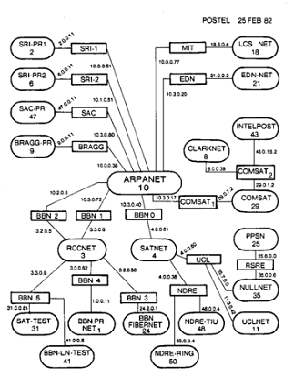

You can think of the history of the internet as a long, messy story about people trying to make distant computers feel “close” — with plenty of false starts, political pressure, and engineering headaches along the way. I’ll keep it in simple, narrative English but still detailed enough for your systems brain.

***

## Before the Internet: Islands of Machines

In the 1950s and early 1960s, computers were giant, expensive islands.  
Each machine lived in its own room, serving one organization, with users connecting via terminals or punched cards directly to that single host. [computerhistory](https://www.computerhistory.org/internethistory/)

If you wanted to share data with another organization’s machine, you didn’t “send it over a network.” You:

- Printed it
- Or wrote it to tape/disk
- Or literally shipped the physical media by post

There were ideas about time‑sharing — multiple users connecting to one powerful computer — but this still assumed a single central machine serving many dumb terminals, not many computers talking to each other as peers. [britannica](https://www.britannica.com/video/did-you-know-history-of-the-internet/-270163)

So the world had many isolated computers, lots of duplicated work, and no standard way to connect them.

***

## The Spark: Cold War Fear and a New Kind of Network

In 1957, the Soviet Union launched Sputnik, the first artificial satellite. [history](https://www.history.com/articles/invention-of-the-internet)
This terrified the U.S. government: if the Soviets could put a satellite in orbit, what else could they do with long‑range missiles and advanced technology ? [history](https://www.history.com/articles/invention-of-the-internet)

The U.S. reacted by:

- Pouring money into research
- Creating ARPA (Advanced Research Projects Agency) in 1958 to fund high‑risk, high‑reward tech projects [telefonica](https://www.telefonica.com/en/communication-room/blog/history-internet-how-come-being-how-evolved/)

One of the fears was simple: **What happens to communications in a nuclear attack?**  
Traditional phone systems used circuit switching — set up a dedicated path end‑to‑end — which was fragile. Destroy a few key switches and large parts of the network could die.

Several researchers started exploring **packet switching**: instead of one dedicated path, you chop data into small packets, each packet finds its own way through a mesh of nodes; if some nodes die, packets can route around them. [telefonica](https://www.telefonica.com/en/communication-room/blog/history-internet-how-come-being-how-evolved/)

Leonard Kleinrock worked on the theory of queuing and packet switching at MIT and UCLA. Paul Baran (RAND) proposed distributed, decentralized network designs resilient to node failures. Donald Davies at the UK National Physical Laboratory (NPL) independently developed packet switching ideas too. [telefonica](https://www.telefonica.com/en/communication-room/blog/history-internet-how-come-being-how-evolved/)

These were early “internet‑like” ideas: many computers, small packets, routing around damage. But at this point, they were mostly papers, prototypes, and small experimental networks — not one global system.

***

## First Attempts: Connecting Just Two Machines

In the mid‑1960s, people tried simple remote connections.  
In 1965, researchers linked a computer in Massachusetts to one in California over a phone line, using a modem. [telefonica](https://www.telefonica.com/en/communication-room/blog/history-internet-how-come-being-how-evolved/)

It “worked” in the sense they could send data, but it was clunky:

- The line was slow and noisy
- The connection was point‑to‑point, not a general “network” you could plug others into
- There was no uniform protocol stack; everything was custom

These experiments showed **remote computer communication was possible**, but they wouldn’t scale. Each connection was special and fragile.

***

## ARPANET: Turning Ideas into a Real Network

ARPA decided to push harder and fund a real, multi‑node packet‑switched network for military and research labs. [computerhistory](https://www.computerhistory.org/internethistory/)
They called it **ARPANET**.

The key design choice: instead of connecting host computers directly to each other, ARPANET introduced small specialized machines called Interface Message Processors (IMPs) — basically early routers. Hosts connected to IMPs, and IMPs passed packets around the network. [computerhistory](https://www.computerhistory.org/internethistory/)

In October 1969, ARPANET successfully sent its first message between UCLA and Stanford Research Institute. [britannica](https://www.britannica.com/video/did-you-know-history-of-the-internet/-270163)
The story is classic: they tried to send the word “LOGIN,” but the system crashed after “LO.”  
It was not a smooth, glorious victory; it was debugging from day one.

Soon, four major nodes were connected — UCLA, Stanford, UC Santa Barbara, and the University of Utah — forming the first real packet‑switched network between geographically separated computers. [telefonica](https://www.telefonica.com/en/communication-room/blog/history-internet-how-come-being-how-evolved/)

### Early Pain Points

Early ARPANET was full of problems:

- No standard host protocols at first — each OS had to figure out how to talk to the IMPs [computerhistory](https://www.computerhistory.org/internethistory/)
- Crashes and congested links as traffic grew
- Limited tools: no web, no friendly interfaces, mostly raw remote login and file transfer

But ARPANET proved something crucial:  
**Multiple, distant computers could share resources over a general‑purpose network.** Not just one point‑to‑point link, but a mesh.

***

## The “Many Networks” Problem: Everything is Fragmented

Through the 1970s, more packet networks appeared:

- ARPANET in the U.S.
- NPL network in the UK
- CYCLADES in France
- SATNET for satellite links
- Local networks at universities and labs [en.wikipedia](https://en.wikipedia.org/wiki/History_of_the_Internet)

Each had:

- Its own hardware
- Its own framing and routing quirks
- Its own host protocols

You could be on ARPANET and talk to other ARPANET nodes, but not easily to NPL or CYCLADES.  
So we had **many small internets**, but no single Internet.

***

## The Big Idea: “Internetworking” and TCP/IP

This fragmentation led to the core internet idea: **a way to interconnect different networks as if they were one**.  

Vint Cerf and Bob Kahn proposed the “Internetting” architecture in the early 1970s. [britannica](https://www.britannica.com/video/did-you-know-history-of-the-internet/-270163)
Their key insights:

- Don’t force all networks to be identical.
- Instead, define a common protocol layer that all networks can support.
- Let this layer handle addressing, fragmentation, and reassembly across heterogeneous networks. [internetsociety](https://www.internetsociety.org/internet/history-internet/brief-history-internet/)

This became **TCP/IP**:

- IP: a best‑effort packet delivery system with global addressing across networks
- TCP: a reliable transport on top of IP, managing connections, sequence, and retransmission [en.wikipedia](https://en.wikipedia.org/wiki/History_of_the_Internet)

This model acknowledges that different networks (radio, satellite, Ethernet, phone lines) exist, but glues them into a single logical network via IP.

It took years of experiments and multiple protocol versions before TCP/IP stabilized.  
Early competing ideas like X.25 and the OSI protocol stack also tried to define universal networking, but ultimately TCP/IP won out in practice. [en.wikipedia](https://en.wikipedia.org/wiki/Internet)

***

## Turning Theory into Infrastructure: 1980s Adoption

By 1980, the U.S. Department of Defense decided to adopt TCP/IP across its networks. [britannica](https://www.britannica.com/video/did-you-know-history-of-the-internet/-270163)
On January 1, 1983, ARPANET officially switched to TCP/IP — often treated as the “birth moment” of the modern internet. [en.wikipedia](https://en.wikipedia.org/wiki/Internet)

Around this time:

- **DNS** appeared, mapping human‑readable names to IP addresses. [geeksforgeeks](https://www.geeksforgeeks.org/websites-apps/history-of-internet/)
- More academic and research networks joined using TCP/IP.
- International links formed, connecting Europe and other regions. [internetsociety](https://www.internetsociety.org/internet/history-internet/brief-history-internet/)

Meanwhile, a parallel effort, the **OSI model and OSI protocols**, tried to define a layered, standardized network architecture. [en.wikipedia](https://en.wikipedia.org/wiki/History_of_the_Internet)
Governments and telecoms invested heavily in OSI, but the stack was complex, slow to implement, and less widely adopted in practice compared to the more pragmatic, evolving TCP/IP stack. [en.wikipedia](https://en.wikipedia.org/wiki/Internet)

You can frame it as one of the big “failed ideas” in internet history: powerful, well‑funded, but outpaced by the simpler, working, deployed TCP/IP system.

***

## The Web: Turning a Research Network into a Human Space

By the late 1980s, the internet existed — as a network of networks — but it was mostly for researchers, military, and university people.  
You used it for:

- Email
- Remote login (telnet)
- File transfer (FTP) [en.wikipedia](https://en.wikipedia.org/wiki/History_of_the_Internet)


```
This 1982 map shows the entire Internet at the time; each oval is a network, and each rectangle is a router
```

In 1989, Tim Berners‑Lee at CERN had a very human problem:  
CERN had documents and information scattered across many systems; it was hard for researchers to find and link things. [prysmian](https://www.prysmian.com/en/insight/telecoms/when-was-the-internet-invented)

His solution was the **World Wide Web**, built on top of the existing internet:

- URLs: a standard way to name resources
- HTTP: a simple protocol to request and send documents
- HTML: a markup language for linking and structuring documents
- A web browser: to actually view and navigate pages [prysmian](https://www.prysmian.com/en/insight/telecoms/when-was-the-internet-invented)

Initially the web was small and internal to CERN, then in 1991–1993 it went public. [prysmian](https://www.prysmian.com/en/insight/telecoms/when-was-the-internet-invented)
CERN made the web protocols royalty‑free, which was crucial: anyone could implement a browser or server. [prysmian](https://www.prysmian.com/en/insight/telecoms/when-was-the-internet-invented)

***

## Growth, Pain, and the Dot‑Com Wave (1990s)

The early 1990s saw fast changes:

- Phone modems became common, allowing homes to dial into ISPs. [telefonica](https://www.telefonica.com/en/communication-room/blog/history-internet-how-come-being-how-evolved/)
- The Mosaic browser (1993) made the web graphical and user‑friendly. [prysmian](https://www.prysmian.com/en/insight/telecoms/when-was-the-internet-invented)
- Netscape Navigator, then early versions of Internet Explorer and others spawned a browser race. [telefonica](https://www.telefonica.com/en/communication-room/blog/history-internet-how-come-being-how-evolved/)

U.S. policy choices also mattered:

- In 1992, U.S. Congress allowed the internet to be used for commercial purposes, not just research. [prysmian](https://www.prysmian.com/en/insight/telecoms/when-was-the-internet-invented)
- ARPANET itself was shut down, but the TCP/IP‑based internet kept growing via commercial providers. [telefonica](https://www.telefonica.com/en/communication-room/blog/history-internet-how-come-being-how-evolved/)

This led to:

- E‑commerce sites (Amazon, eBay)
- Search engines (Gopher early on, then Yahoo, and Google in 1998) [telefonica](https://www.telefonica.com/en/communication-room/blog/history-internet-how-come-being-how-evolved/)
- Massive speculation and venture funding — the “dot‑com bubble” [scienceandmediamuseum.org](https://www.scienceandmediamuseum.org.uk/objects-and-stories/short-history-internet)

Technical issues:

- Scaling routing tables as more networks joined
- Handling more traffic and congestion
- Designing better protocols and infrastructure, like HTTP improvements, caching, and early CDNs [internetsociety](https://www.internetsociety.org/internet/history-internet/brief-history-internet/)

When the bubble burst around 2000, many companies died, but the underlying infrastructure — data centers, fiber cables, backbone capacity — remained, ready for the next wave.

***

## Web 2.0, Mobile, and Cloud: Still the Same Old TCP/IP

In the 2000s, the internet changed shape again:

- Web 2.0: sites focused on user‑generated content, social networks, wikis, blogs, and interactive apps. [britannica](https://www.britannica.com/video/did-you-know-history-of-the-internet/-270163)
- Always‑on connectivity: broadband replaced dial‑up, making the internet a constant background presence. [en.wikipedia](https://en.wikipedia.org/wiki/Internet)
- Mobile: smartphones and 3G/4G links moved the internet into pockets and everyday life. [en.wikipedia](https://en.wikipedia.org/wiki/Internet)

Technically, though, most of this still ran over:

- IP for routing
- TCP (and later more UDP‑based protocols) for transport
- HTTP/HTTPS for application‑level communication [en.wikipedia](https://en.wikipedia.org/wiki/Internet)

Cloud computing took it further:  
Instead of the internet just being “a way to fetch web pages,” it became the substrate for remote compute, storage, and services — AWS, GCP, Azure built huge virtual networks on top of the same basic stack. [internetsociety](https://www.internetsociety.org/internet/history-internet/brief-history-internet/)

***

## Big Themes: Failed Ideas and Hard Problems

A few important threads from this whole story:

1. **Failed or sidelined ideas**  
   - OSI protocol stack: elegant but heavy; lost to TCP/IP’s simpler, deployed reality. [en.wikipedia](https://en.wikipedia.org/wiki/History_of_the_Internet)
   - Centralized circuit‑switched data networks: fragile and poorly suited to failure and scaling compared to packet switching. [telefonica](https://www.telefonica.com/en/communication-room/blog/history-internet-how-come-being-how-evolved/)

2. **Persistent issues engineers wrestled with**  
   - Routing at scale: how to keep routing tables from exploding as more networks join. [internetsociety](https://www.internetsociety.org/internet/history-internet/brief-history-internet/)
   - Congestion control: TCP’s evolution, especially post‑1980s congestion collapse events, is a big part of making the internet usable. [en.wikipedia](https://en.wikipedia.org/wiki/History_of_the_Internet)
   - Interoperability: getting heterogeneous, independently developed systems to follow shared protocols without breaking each other. [internetsociety](https://www.internetsociety.org/internet/history-internet/brief-history-internet/)

3. **Growth pattern**  
   - Military and research need (Cold War, ARPA) →  
   - Multiple experimental networks →  
   - TCP/IP as glue →  
   - Academic and government adoption →  
   - Commercial and public access →  
   - Web as the human interface →  
   - Mobile, social, cloud as long layers on top. [en.wikipedia](https://en.wikipedia.org/wiki/History_of_the_Internet)

***

## Why This Story Matters for You as an Engineer

Seeing the internet as a story rather than a static diagram helps:

- Every protocol you use (DNS, TCP, HTTP) is a response to some earlier pain — scaling, interoperability, resilience, or usability.  
- You understand why abstractions exist the way they do: IP doesn’t guarantee delivery because it was designed as a simple “glue” layer across unreliable networks, leaving reliability to higher layers.  
- When you design systems today, you’re continuing a 60‑year pattern: accept heterogeneity, push reliability up the stack, and expect your network to be partial, imperfect, and evolving.