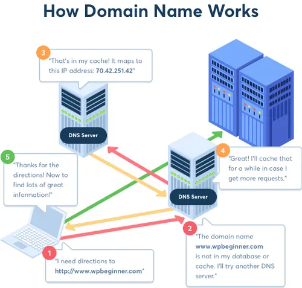

story of DNS as a simple “short story” about naming on the internet, from pre‑DNS chaos to the system you use every time you type a URL.

***

## Chapter 1: Life Before DNS – The Age of HOSTS.TXT

In the early ARPANET days, there were only a few dozen machines on the network.  
People still wanted human‑friendly names like `SRI`, `UCLA`, or `MIT` instead of bare numeric addresses, so they kept a simple list of “who is who”. [livinginternet](https://www.livinginternet.com/i/iw_dns_history.htm)

That list lived in a single text file called `HOSTS.TXT`, maintained by the Network Information Center (NIC) at SRI (Stanford Research Institute). [dnsinstitute](https://dnsinstitute.com/dns-history/dns-history-timeline/)
It contained lines like:

```
10.2.0.5   SRI-NIC
10.2.0.6   UCLA
...
```

If you were running a host on the network, you:

1. Fetched the latest `HOSTS.TXT` from SRI via FTP.
2. Dropped it into your system.
3. Used it to map hostnames to addresses.

At first, this felt fine. The network was small, the file was manageable, and updating it occasionally worked.

But growth broke this simplicity.

As more organizations joined, `HOSTS.TXT`:

- Grew larger and larger.
- Became outdated quickly.
- Needed manual coordination for every new host or name. [livinginternet](https://www.livinginternet.com/i/iw_dns_history.htm)

One frustrated RFC in 1973 literally complained about the “absurd situation where each site on the network must maintain a different, generally out‑of‑date, host list”. [dnsinstitute](https://dnsinstitute.com/dns-history/dns-history-timeline/)
Engineers could see the future: if the network kept growing, a single central text file would become a bottleneck and a failure point.

The internet was becoming too big for a shared spreadsheet.

***

## Chapter 2: The Naming Problem Becomes Real

By the late 1970s and early 1980s, ARPANET and other networks were expanding.  
Email was becoming important, and people wanted consistent, structured addresses — `user@host` patterns and later more complex names. [livinginternet](https://www.livinginternet.com/i/iw_dns_history.htm)

Several small steps tried to improve naming:

- The NIC refined `HOSTS.TXT` formats and made them more structured.
- A provisional name server experiment tried to serve name/address information from a central server. [dnsinstitute](https://dnsinstitute.com/dns-history/dns-history-timeline/)
- People started talking about “domains” — grouping names hierarchically, not just flat host lists. [dnsinstitute](https://dnsinstitute.com/dns-history/dns-history-timeline/)

But deep down, everyone knew the central approach was wrong:

- One organization (SRI) was effectively gatekeeping all names.
- Every change to `HOSTS.TXT` required coordination.
- As the number of hosts grew, so did the risk of inconsistency and delay.

You can imagine being a sysadmin then:  
You add a new machine, email NIC, wait for them to update the master file, then hope everyone fetches the new version. If they don’t, some users can reach you, others can’t.

The core problem: a growing, distributed system was being managed like a small static configuration file.

***

## Chapter 3: The Big Idea – Distributed Naming

By 1982, key people were thinking in terms of **domains** and distributed name service. [cyber.harvard](https://cyber.harvard.edu/icann/pressingissues2000/briefingbook/dnshistory.html)

Two names matter a lot here:

- Jon Postel (USC/ISI), heavily involved in internet protocols and naming.
- Paul Mockapetris (also at ISI), who ultimately designed what became DNS. [isi](https://www.isi.edu/news/972810/and-the-dns-was-born/)

They saw that naming needed properties much like routing:

- **Distribution**: no single place that knows everything.
- **Delegation**: each organization controls its own part of the namespace.
- **Hierarchy**: names carry structure (like `host.department.organization`). [cyber.harvard](https://cyber.harvard.edu/icann/pressingissues2000/briefingbook/dnshistory.html)

In 1982, proposals started to formalize this:

- Use a **domain concept**, where names are hierarchical and controlled by registrars and naming authorities. [dnsinstitute](https://dnsinstitute.com/dns-history/dns-history-timeline/)
- Replace a single flat hostname file with a system of name servers that answer queries for their part of the name space. [cyber.harvard](https://cyber.harvard.edu/icann/pressingissues2000/briefingbook/dnshistory.html)

This was not just “an improved file format.”  
It was a shift from:

> “Everyone shares one big list”

to

> “Each part of the name space is owned and answered by its own servers, and we **ask around** when we need an answer.”

***

## Chapter 4: DNS Is Born

Around 1983–1984, Mockapetris designed and specified the **Domain Name System (DNS)** in a set of RFCs (notably RFC 882 and 883 originally, later refined). [en.wikipedia](https://en.wikipedia.org/wiki/Domain_Name_System)
The idea was simple but powerful:

- Human‑readable **domain names** (like `example.com`) are mapped to resource records.
- **Authoritative name servers** hold the truth for a specific zone (like `example.com`).
- **Recursive resolvers** perform the multi‑step lookup on behalf of clients.

At the same time:

- A limited set of top‑level domains was introduced: `.com`, `.edu`, `.gov`, `.mil`, `.org`, plus country codes like `.uk`, `.in`, `.de` based on ISO‑3166. [cyber.harvard](https://cyber.harvard.edu/icann/pressingissues2000/briefingbook/dnshistory.html)
- The existing `HOSTS.TXT` infrastructure was scheduled to be phased out; domain names would become the new standard. [dnsinstitute](https://dnsinstitute.com/dns-history/dns-history-timeline/)

On the implementation side, graduate students at Berkeley built **BIND** (Berkeley Internet Name Domain), a full DNS server and database implementation for 4.2BSD Unix. [dnsinstitute](https://dnsinstitute.com/dns-history/dns-history-timeline/)
BIND became the reference implementation and spread widely, effectively dragging DNS into real deployment.

By 1984–1985:

- DNS servers were actually running.
- The new domains were being used.
- `HOSTS.TXT` was being deprecated in favor of DNS queries. [cyber.harvard](https://cyber.harvard.edu/icann/pressingissues2000/briefingbook/dnshistory.html)

The fragile central text file had finally been replaced by a globally distributed naming system.

***

## Chapter 5: How DNS Works (At a Story Level)

For a developer in the late 80s or today, a DNS lookup feels simple: you type `www.example.com` and you get back an IP address.

Under the hood, the story is:

1. Your machine asks a **resolver** (often run by your ISP or OS).
2. The resolver checks cache; if it doesn’t know, it starts a journey:
   - Ask a **root server**: “Where do I learn about `.com`?”
   - Ask the `.com` **TLD server**: “Where are the name servers for `example.com`?”
   - Ask the **authoritative server** for `example.com`: “What’s the A record for `www.example.com`?”
3. The authoritative server replies with the IP.
4. The resolver returns that IP to your machine and caches it for next time. [kodekloud](https://kodekloud.com/blog/dns-explained-a-simple-guide/)

The hierarchy and delegation make this scalable:

- Root servers don’t need to know every domain; they only know where each TLD is managed.
- TLD servers don’t know every host; they know which name servers are authoritative for each domain.
- Each organization controls its own DNS zone: it can add or remove records independently.

Compare that to one central `HOSTS.TXT` — the difference is night and day.

***

## Chapter 6: Growing Pains and Security Problems

As DNS usage exploded along with the web and the commercial internet, new problems appeared.

### Performance & Scale

DNS had to handle:

- Many more domains (from hundreds to millions to hundreds of millions).
- Many more queries per second, worldwide.

Caching and TTLs (time‑to‑live) became crucial.  
Resolvers aggressively cache answers to avoid repeatedly climbing the hierarchy, making DNS more efficient and reducing load on root and TLD servers. [akamai](https://www.akamai.com/glossary/what-is-dns)

### Security Issues

DNS was originally designed in a relatively “trusting” environment — research networks, fewer hostile actors.  
That led to problems:

- Predictable query IDs and lack of strong authentication allowed **cache poisoning**: an attacker could trick a resolver into caching a fake answer, sending users to malicious sites. [slideshare](https://www.slideshare.net/slideshow/the-history-of-dns/66396290?nway-=)
- Spoofing referrals and responses was possible because DNS didn’t cryptographically verify who sent which data. [slideshare](https://www.slideshare.net/slideshow/the-history-of-dns/66396290?nway-=)

Researchers like Steven Bellovin and Christoph Schuba documented these weaknesses and pointed toward the need for cryptographic signatures and better integrity checks. [dnsinstitute](https://dnsinstitute.com/dns-history/dns-history-timeline/)

In the 1990s and 2000s, work on **DNSSEC** began — DNS Security Extensions.  
DNSSEC adds:

- Digital signatures to DNS records.
- A chain of trust from the root zone down through TLDs to individual domains. [slideshare](https://www.slideshare.net/slideshow/the-history-of-dns/66396290?nway-=)

The idea is to let resolvers verify that the data they’re getting is authentic and hasn’t been tampered with.  
This doesn’t hide data (it’s not encryption for privacy), but it defends against many spoofing and poisoning attacks.

Real‑world deployment of DNSSEC has been slow and incremental, but it’s now part of the security toolbox for critical domains.

***

## Chapter 7: DNS Today – Invisible, Essential, Often Blamed

Now, DNS is:

- A globally distributed database of names and records.
- One of the highest‑volume systems on the internet.
- A critical dependency for almost every HTTP request, email, and API call. [ibm](https://www.ibm.com/think/topics/dns)

When you:

- Register a domain, a registrar and registry wire your name into this hierarchy, setting up NS records and zone files. [youtube](https://www.youtube.com/watch?v=UVR9lhUGAyU)
- Configure services (web servers, mail servers, CDNs), you mostly “just” set DNS records: A, AAAA, CNAME, MX, TXT, etc.. [youtube](https://www.youtube.com/watch?v=UVR9lhUGAyU)
- Hit production issues, “it’s DNS” is often the first joking assumption — and sometimes it really is: wrong records, missing records, cache issues, or propagation delays.

Despite decades of change in browsers, protocols, and infrastructure, the core DNS ideas from the 1980s — hierarchy, delegation, distributed name servers, caching — are still the backbone.

***

## DNS as Part of the Larger Internet Story



From a systems perspective, the story of DNS fits nicely into the broader internet history:

- The network grew too big for central control (HOSTS.TXT).
- Hierarchy and delegation replaced global shared state.
- A relatively simple protocol, widely implemented (BIND, others), became the de facto standard.
- Security and scale issues emerged and were patched with extensions (DNSSEC, better resolvers, anycast root servers).

As an engineer, that mental model is useful:

- Whenever your system’s “config” starts looking like `HOSTS.TXT` — a single, growing file that everyone relies on — it’s a signal that you might need something more DNS‑like: delegation, hierarchy, and distributed authority.
- When you design internal service discovery (for microservices, Kubernetes, etc.), DNS and its evolution offer a blueprint for balancing simplicity, scale, and autonomy.

next you can zoom in on “modern DNS internals” — resolvers, caches, TTLs, record types — explicitly from the point of view of what happens when your code calls `getaddrinfo()` or hits `curl` with a hostname.