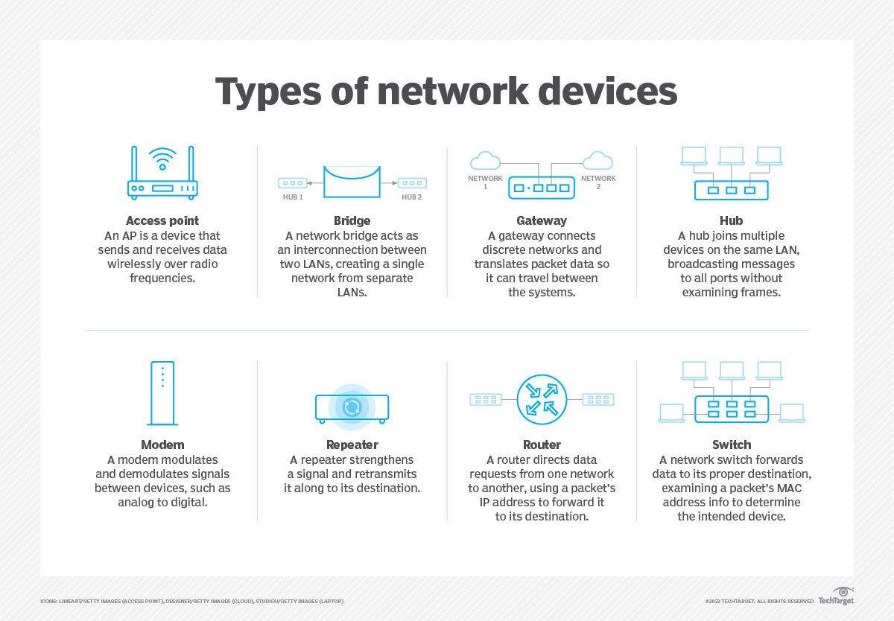

Important networking devices are the “characters” that make a network work: they connect, direct, translate, and protect traffic. I’ll keep it focused and practical.
## Big Picture
At a high level, you can group devices into:

- Devices that connect hosts into a local network.
- Devices that connect networks to other networks (and the internet).
- Devices that extend, translate, or secure traffic.

***


## Core Devices
### Network Interface Card (NIC)
- Lives inside a computer, server, phone, etc.
- Gives the device a physical/network interface (Ethernet port or Wi‑Fi radio) and a MAC address.
- Without a NIC, the device can’t “speak” on the network at all.
### Hub (Mostly Historical)
- Simple “multi‑port repeater.”
- Receives bits on one port and broadcasts them to all other ports.
- No intelligence: no MAC learning, no filtering, lots of collisions; largely replaced by switches.
### Switch
- Connects devices within a LAN, at Layer 2.
- Learns MAC addresses and forwards frames only to the right port.
- Reduces collisions, increases effective bandwidth, forms the backbone of modern LANs.
- Managed switches add VLANs, QoS, monitoring, etc.
### Bridge
- Early device that connects two LAN segments and filters frames based on MAC.
- Conceptually similar to a small, two‑port switch.
- Used for segmenting/breaking up collision domains; mostly replaced by switches, but the idea lives on in “bridging” between interfaces.
### Router
- Connects different IP networks, at Layer 3.
- Looks at IP headers and makes forwarding decisions based on routing tables.
- Your home “Wi‑Fi router” usually combines router + switch + access point + small firewall in one box.
### Access Point (AP)
- Provides Wi‑Fi.
- Bridges wireless clients into a wired LAN.
- Enterprise APs are usually controlled by a central controller, handle multiple SSIDs, VLANs, roaming, etc.
### Modem
- Modulator/demodulator that converts between digital signals and the analog/physical signals used on phone/cable/fiber lines.
- DSL/cable/fiber modems sit between your local router and the ISP’s access network.
- In many home setups, the “router” is actually a router+modem combo.
### Repeater
- Regenerates/amplifies signals to extend physical reach.
- Used in long copper runs, fiber repeaters, or even Wi‑Fi “range extenders.”
- Works at the physical layer; it doesn’t understand frames or packets.
### Gateway
- Generic term for a device that acts as an entry/exit point between networks with different protocols or formats.
- At home, your default gateway is usually your router’s IP.
- In more complex setups, “application gateways” translate protocols (e.g., email gateway, VoIP gateway).

***
## Security and Traffic Management
### Firewall
- Filters traffic based on rules (IP, ports, protocols, state).
- Can be a dedicated hardware appliance, a virtual device, or built into an OS/router.
- Often also does NAT, logging, intrusion detection/prevention.
### Load Balancer
- Distributes incoming traffic across multiple servers.
- Can work at Layer 4 (TCP/UDP) or Layer 7 (HTTP, etc.).
- Essential in high‑availability and scalable web architectures.
### Proxy Server
- Sits between clients and servers, forwarding requests on behalf of clients.
- Used for caching, access control, anonymity, or protocol translation.

***
## How They Fit Together (Typical Home/Office)
A very simplified small‑office setup:

```text
Devices (PCs, phones) --(NIC)-->
Switch ----> Router/Firewall ----> Modem ----> ISP ----> Internet
              │
              └--> Access Point (Wi‑Fi)
```

Understanding what each box does helps a lot when debugging: if Wi‑Fi works but not the internet, you know to look beyond the AP; if local file sharing fails but internet works, you look at the switch/LAN side, etc.
