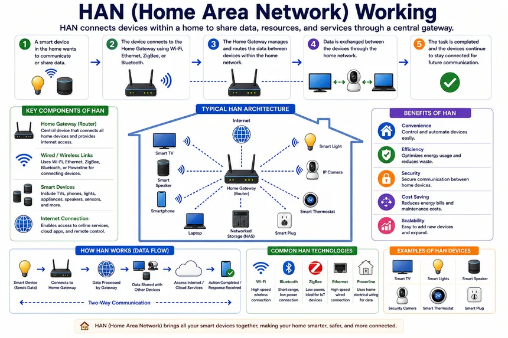
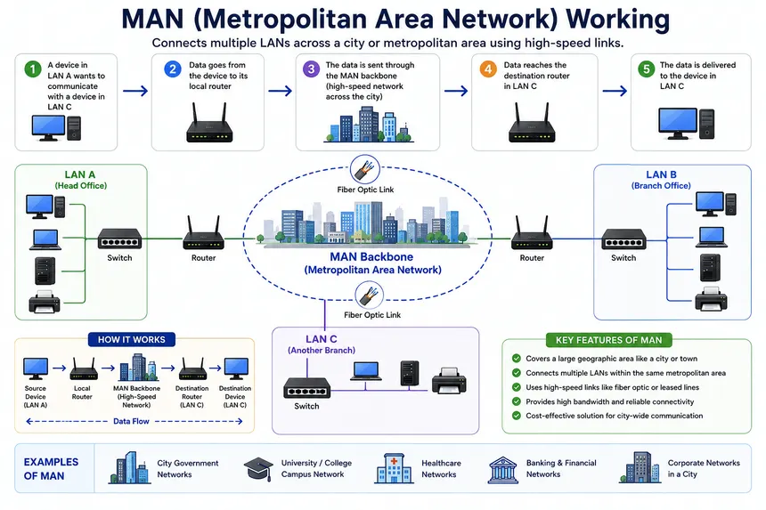
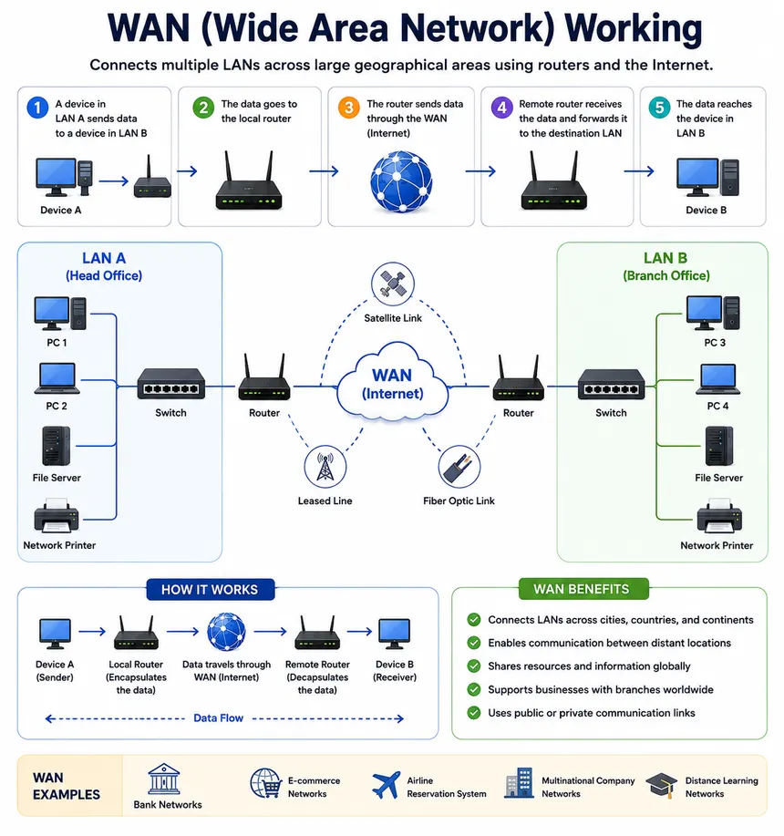

You can classify “types of networks” in many ways, but the most useful starting point is by physical/geographical scope. I’ll keep it tight and practical.

## By Size / Area

### PAN – Personal Area Network

- Very small, around one person.
- Examples: your phone connected to your earbuds via Bluetooth; smartwatch + phone.
- Scope: a few meters.

### LAN – Local Area Network

- Connects devices in a small area like a home, office, or lab.
- Examples: your home Wi‑Fi + wired devices; office floor network.
- Scope: room, building, small campus.

### WLAN – Wireless LAN

- A LAN implemented over Wi‑Fi instead of only Ethernet cables.
- Same scope as LAN, but with wireless access points.

### CAN – Campus Area Network

- Connects multiple LANs across a campus or set of buildings (e.g., a university, corporate campus).
- Scope: multiple buildings in one organization.

### MAN – Metropolitan Area Network

- Connects LANs across a city or metro region.
- Examples: city government network, ISP’s access network inside a city.
- Scope: city‑scale.

### WAN – Wide Area Network

- Connects networks over large geographic areas, countries, or globally.
- The internet itself is the biggest WAN.
- Examples: a company’s global network linking offices on different continents.

---

## By Purpose / Function

### SAN – Storage Area Network

- Dedicated high‑speed network for storage devices and servers.
- Used in data centers for block‑level storage, backups, and clustering.

### VPN – Virtual Private Network

- Logical/virtual private network built on top of a public WAN (usually the internet).
- Encrypts traffic and makes remote devices appear as if they’re on the same private network.

### EPN – Enterprise Private Network

- Private network owned/managed by an organization to link its sites securely.
- Often implemented using leased lines, MPLS, or site‑to‑site VPNs.

---

## One‑Line Mental Model

- PAN/LAN/WLAN → very local.
- CAN/MAN → mid‑scale (campus or city).
- WAN → long‑distance, multi‑region.
- SAN/VPN/EPN → specialized overlays for storage or secure/private connectivity.
