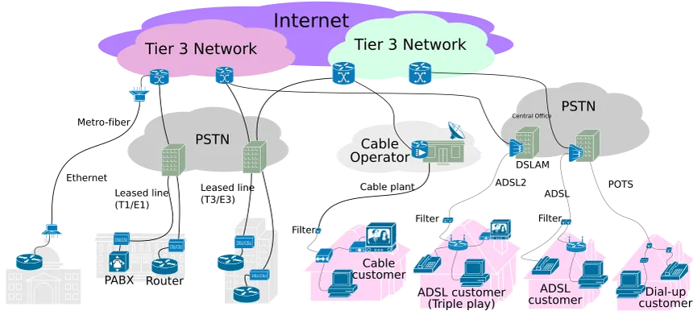

Internet reaching your home is basically a story of “big global cables → your ISP → your street → your modem/router → your devices.” I’ll walk through it step by step in simple language.

***
## 1. The Global Backbone
Far away from your house, the internet lives on:

- Huge data centers full of servers (websites, apps, APIs).
- High‑capacity fiber cables connecting cities and countries, including submarine cables under the ocean.

These make up the **internet backbone**: very fast, very long‑distance connections that carry traffic between major networks and regions.

***
## 2. Your ISP Connects to That Backbone
Your Internet Service Provider (ISP) — Jio, Airtel, BSNL, ACT, etc. in India — hooks into this backbone at big exchange points.

You can imagine it like:

```text
Global backbone (long fiber cables)
          ↓
City / regional ISP network
```

The ISP then builds its own network across your city or region:

- Fiber rings or trunks
- Distribution cabinets/boxes
- Smaller access lines that fan out toward neighborhoods

***
## 3. The “Last Mile” to Your Neighborhood
At some point, the ISP’s city‑level cables reach closer to homes:

- Fiber or coax cables go to street cabinets or boxes on poles.
- From there, the signal is split and directed to individual buildings or houses.

This stretch is often called the **last mile** (even if it’s not literally one mile):

```text
ISP core network
      ↓
Street / building box
      ↓
Cable to your home
```

Depending on your plan and location, that cable might be:

- Fiber (FTTH / FTTP – Fiber to the Home/Premises)
- Coax (cable internet)
- Telephone copper pair (DSL)
- In rural/remote cases, even wireless or satellite

***
## 4. Into Your House: Modem and Router

Once the ISP’s cable reaches your house, you need two key devices:
### Modem (or ONT for fiber)
- Speaks the “language” of the ISP’s line (fiber, DSL, cable).
- Converts signals from the ISP into digital data your network equipment understands.
- Without a modem/ONT, your devices can’t talk to the ISP’s network.
### Router (often combined with Wi‑Fi)
- Creates your **home network** (LAN).
- Gives your devices local IP addresses.
- Decides where outgoing packets should go and forwards them to the modem.
- Distributes connectivity via Ethernet ports and Wi‑Fi.

Home setup often looks like:

```text
ISP cable → Modem/ONT → Router/Wi‑Fi → Your devices
```

Sometimes the modem and router are in one box, which is why people just call it “the Wi‑Fi router.”

***
## 5. What Happens When You Open a Website
Let’s say you tap a link on your phone:

1. Your phone sends the request over Wi‑Fi to the router.
2. The router forwards it to the modem.
3. The modem sends it into the ISP’s network.
4. The ISP routes it through its network and onto the broader internet backbone toward the website’s server.
5. The server responds, and the data comes back the same way, eventually reaching your router, then your phone.

All this happens in milliseconds, unless there’s congestion or a fault.

***
## 6. Different Technologies, Same Idea
The physical tech may differ:

- **Fiber**: light pulses in glass; very fast, good for long distances.
- **Copper/DSL**: electrical signals over phone lines; slower and more noise‑prone.
- **Coax (cable)**: electrical signals over thick shielded copper; good bandwidth.
- **Wireless / Satellite**: radio or satellite links; useful where wires are hard, often higher latency.

But the logical structure is the same:

```text
Server somewhere on the internet
      ↕ (backbone)
ISP network (regional)
      ↕ (last mile)
Modem/ONT
      ↕
Router/Wi‑Fi
      ↕
Your device
```
