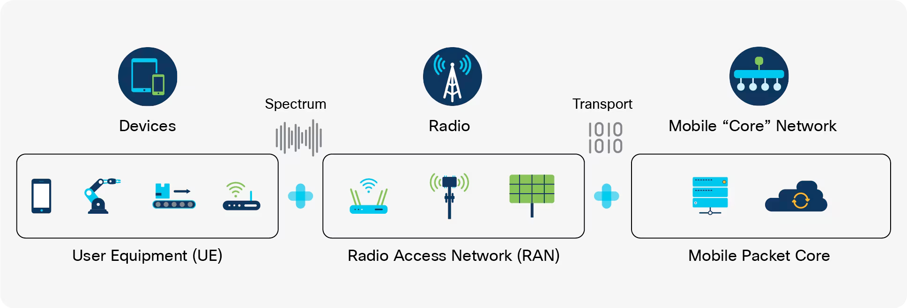

Mobile internet is just “internet over radio”: your phone talks to nearby cell towers with radio waves, and those towers are connected to the wider internet by cables and core networks.



I’ll walk through it step by step in simple language.

***
## 1. Your Phone Talks to a Cell Tower
When you turn on mobile data:

- Your SIM card identifies you to your mobile operator (Jio, Airtel, etc.).
- Your phone uses its antenna to send and receive radio signals to the nearest cell tower.
- The tower covers a small area called a **cell**. Many cells together cover a city or region.

So instead of a cable from your phone to the ISP, you have a **radio link** to a base station (cell tower).

***
## 2. The Tower Connects to the Operator’s Network
That cell tower isn’t isolated; it’s wired into the operator’s network:

- Usually via fiber or high‑capacity microwave links.
- It forwards your data (packets) into the operator’s **core network**.

Inside the core network:

- Your traffic is routed like in any IP network.
- It passes through gateways and routers that connect to the public internet.

You can imagine:

```text
Phone ↔ Cell Tower ↔ Mobile Operator Core ↔ Internet Backbone ↔ Website/API
```

***
## 3. What Happens When You Open a Website
Say you tap a link in your browser:

1. Phone creates an HTTP request packet.
2. Packet is sent over the radio to the nearest tower using 4G/5G radio technology.
3. Tower forwards it into the operator’s core network.
4. Operator routes it out to the target server somewhere on the internet.
5. Server sends back a response the same way, returning through:
   - Internet backbone → operator core → tower → radio → your phone.

All the usual internet protocols (IP, TCP, HTTP, DNS) are still there — the only special part is the **wireless last mile** between your phone and the tower.

***
## 4. 3G vs 4G vs 5G (Intuition Only)
- **3G**: First usable mobile internet for web and apps, but slower and higher latency.
- **4G (LTE)**: Much faster, better for video, VoIP, and rich apps.
- **5G**: Designed for even higher speeds and lower latency, plus more devices (IoT).

They all share the same basic idea:

- Radio from phone → base station.
- Then normal IP routing through operator → internet.

The differences are mostly in how efficiently they use radio spectrum, how they schedule users, and how much data per second they can push.

***
## 5. Why Mobile Internet Can Feel Different from Home Broadband
- Signal strength: Far tower, buildings, or interference → weaker signal → lower speed.
- Shared medium: Many users in the same cell share radio resources; congestion hurts performance.
- Mobility: As you move, the network hands your phone over from one tower to another; that has to happen seamlessly.

But conceptually it’s the same pipeline:

```text
Home broadband: Device → Router → ISP → Internet
Mobile internet: Device → Cell tower → Mobile core → Internet
```
