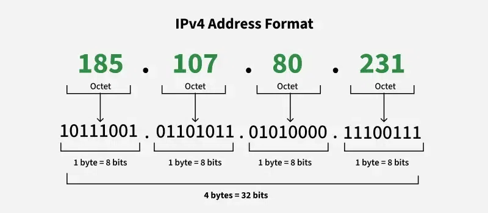

# Deep Note: Understanding IPv4 Addresses, Subnet Masks, and Broadcast Addresses

## 1. What an IPv4 Address Actually Is

An IPv4 address is a 32‑bit integer that identifies a **network interface** in an IP network.

- Internally: 32 bits.
- Externally: written as 4 bytes (octets) in dotted‑decimal form.



Example:

```text
192.168.1.10
```

Binary:

```text
192      . 168      . 1        . 10
11000000 . 10101000 . 00000001 . 00001010  (32 bits total)
```

Total address space: \(2^{32} \approx 4.3\) billion possible addresses.

---

## 2. Network Part vs Host Part

Every IPv4 address has two conceptual parts:

- **Network part** (prefix): which network this address belongs to.
- **Host part**: which specific interface inside that network.

The split is defined by the **subnet mask** (or prefix length `/N`).

Example:

- Address: `192.168.1.10`
- Mask: `255.255.255.0` → prefix `/24`

Mask in binary:

```text
255      . 255      . 255      . 0
11111111 . 11111111 . 11111111 . 00000000
```

Interpretation:

- First 24 bits (`111…`) → network part (`192.168.1`)
- Last 8 bits (`000…`) → host part (the `.10`)

In code terms:

```text
network = ip & mask
host    = ip & ~mask
```

Routers care about the network portion; hosts care about both.

---

## 3. Subnet Masks: What 255 Means

A subnet mask is a bitmask overlay on the 32‑bit address:

- Bits set to `1` → “these bits belong to the network.”
- Bits set to `0` → “these bits belong to the host.”

Key values:

- `255` in decimal = `11111111` in binary → all 8 bits are network bits.
- `0` in decimal = `00000000` in binary → all 8 bits are host bits.

Subnet masks are always of the form:

```text
11111111 11111111 11111111 00000000
^^^^^^^^^^^^^^^^^^^^^^^^^^ ^^^^^^^^^
   contiguous 1s (network) contiguous 0s (host)
```

You never have masks like `00000111` or `10101010`, because that would break the idea of a clean prefix (you couldn’t do proper longest‑prefix matching).

---

## 4. Prefix Length `/N` and Mask Relationship

`/N` means: “first N bits are network bits; the remaining \(32 - N\) are host bits.”

Examples:

- `/24` → 24 network bits, 8 host bits.
  - Mask: `255.255.255.0`
- `/27` → 27 network bits, 5 host bits.
  - Mask: `255.255.255.224`
- `/30` → 30 network bits, 2 host bits.
  - Mask: `255.255.255.252`

### Why `/27` → `255.255.255.224`

Start with 27 ones, then 5 zeros:

```text
11111111 11111111 11111111 11100000
```

Group into octets:

- `11111111` → 255
- `11111111` → 255
- `11111111` → 255
- `11100000` → \(128 + 64 + 32 = 224\)

So the mask is:

```text
255.255.255.224
```

Important detail:

> The new network bits are added on the **left side** of the last octet (`11100000`), not on the right (`00000111`).

A mask like `255.255.255.7` would be binary `00000111` in the last octet, which is invalid because the 1s wouldn’t be contiguous from the left.

---

## 5. Last Octet Values Cheat Sheet

For prefixes that cut into the last octet (`/25`–`/32`), the last octet of the mask is always one of:

| Prefix | Last octet (binary) | Last octet (decimal) |
| ------ | ------------------- | -------------------- |
| /24    | 00000000            | 0                    |
| /25    | 10000000            | 128                  |
| /26    | 11000000            | 192                  |
| /27    | 11100000            | 224                  |
| /28    | 11110000            | 240                  |
| /29    | 11111000            | 248                  |
| /30    | 11111100            | 252                  |
| /31    | 11111110            | 254                  |
| /32    | 11111111            | 255                  |

Quick mental rule for `N > 24`:

- Extra bits in last octet = `N − 24`.
- Use that many leading ones in binary (`11100000` for 3 bits).
- Convert to decimal.

---

## 6. Subnet Size and Address Ranges

Given a prefix `/N`:

- Host bits = `32 − N`.
- Total addresses per subnet = \(2^{32-N}\).
- Usable hosts = total − 2 (network + broadcast), in normal subnets.

Example `/27`:

- Host bits = 5 → total addresses = \(2^5 = 32\).
- Usable hosts = 32 − 2 = 30.

Block size in last octet for `/27`:

- Last octet mask = 224.
- Block size = \(256 − 224 = 32\).

So valid subnets in the last octet are:

```text
0, 32, 64, 96, 128, 160, 192, 224
```

Each is a subnet of 32 addresses.

---

## 7. Concrete Example: 192.168.10.0/27

Let’s use your example and tie it to both mask and broadcast.

### 7.1. Mask

For `192.168.10.0/27`:

- Subnet mask: `255.255.255.224`.
- This is what you configure as the mask on hosts/routers.

Binary:

```text
255.255.255.224
11111111.11111111.11111111.11100000
```

### 7.2. Subnet Range

Block size in last octet = 32, so the first subnet is:

- Start: `.0`
- End: `.31`

Thus:

- Network address: `192.168.10.0`
- First usable host: `192.168.10.1`
- Last usable host: `192.168.10.30`
- **Broadcast address: `192.168.10.31`**

Note: The **broadcast address is not the subnet mask**. The mask stays `255.255.255.224`; the broadcast is the last IP in that subnet.

## 7.3. Binary View of Broadcast for 192.168.10.0/27

We have:

- Network: `192.168.10.0/27`
- Mask: `255.255.255.224`
- Wildcard (inverse of mask): `0.0.0.31`

Let’s look at the last octet in binary:

- Network address last octet: `0` → `00000000`
- Mask last octet: `224` → `11100000`
- Wildcard last octet: `31` → `00011111` (since `255 − 224 = 31`)

Broadcast is computed as:

- `broadcast = network_address OR wildcard`

Last octet:

```text
00000000  (network last octet)
OR 00011111  (wildcard last octet)
= 00011111  (binary 31)
```

So the full addresses are:

- Network: `192.168.10.0`
- First host: `192.168.10.1`
- Last host: `192.168.10.30`
- Broadcast: `192.168.10.31`
- Subnet mask: `255.255.255.224` (separate from the broadcast)

This reinforces the key distinction:

- The **subnet mask** describes which bits are network vs host.
- The **broadcast address** is the last IP in that subnet’s address range (all host bits set to 1 within that subnet).

---

## 8. Private vs Public IPv4 Address Space (Recap)

Because IPv4 has limited space, we reserve private ranges for internal use:

- `10.0.0.0/8` → 10.x.x.x
- `172.16.0.0/12`→ 172.16.0.0 – 172.31.255.255
- `192.168.0.0/16`→ 192.168.x.x

Private addresses:

- Used inside LANs (home, office).
- Not routed on the public internet.

Public addresses:

- Globally unique, routable.
- Allocated by global/regional authorities.

NAT lets many private hosts share one public IPv4.

---

## 9. How Routers Use All of This

Routers store routes as prefixes:

- Example: `192.168.10.0/27 → next hop X`

When a packet arrives:

1. Router reads the destination IP.
2. Computes the network by applying the mask: `dest_ip & mask`.
3. Compares to prefixes in its routing table.
4. Picks the route whose prefix matches with the **longest number of bits** (longest‑prefix match).
5. Forwards the packet accordingly.

The mask/prefix length is what tells the router **how much of the address** to use for matching.

---

## 10. Key Mental Takeaways

If you were to boil this down for quick recall:

- IPv4 address = 32‑bit integer, written as 4 octets.
- Subnet mask = 32‑bit bitmask with contiguous 1s (network) then 0s (host).
- `/N` → first N bits are network bits; mask is defined by those N bits being 1.
- `255` in a mask = `11111111` → “all 8 bits in this octet are network bits.”
- For `/27`, mask is `255.255.255.224` (last octet `11100000`), not `.7`.
- Subnet size for `/27` = 32 addresses; block size in last octet = 32 (0, 32, 64, …).
- Broadcast address = last IP in the subnet’s range (network address + all host bits set to 1), e.g., `192.168.10.31` for `192.168.10.0/27`
