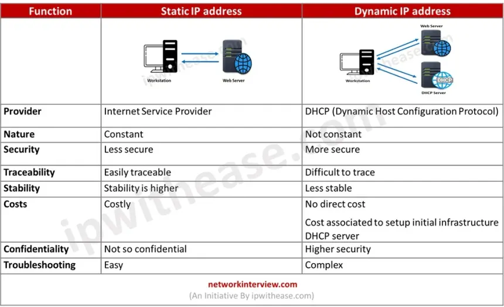

# Static vs Dynamic IP Addresses (and Router‑Assigned Static IPs)

## 1. What an IP Address Is in This Context

We’re talking about **IPv4 addresses on a network interface**:

- Example: `192.168.1.10`
- Used to identify a device on a network so packets can be routed to/from it.

You can manage these addresses in two broad ways: **static** and **dynamic**.

***

## 2. Static IP Address

A **static IP address** is one that does **not change automatically**. It stays the same until someone explicitly reconfigures it.

Two ways to get a static IP:

1. **Manually configured on the device itself**  
   - You set IP, subnet mask, gateway, and DNS in the device’s network settings.
   - The device never asks DHCP for an IP; it just uses the one you gave it.

2. **Reserved/static assignment from the router (DHCP reservation)**  
   - The device still uses DHCP.
   - The router is configured to always give that device the same IP based on its MAC address.

Use cases:

- Servers, NAS, printers, home automation hubs.
- Routers, firewalls, and infrastructure devices.
- Anything other hosts/scripts need to reach at a known, stable IP.

On the **internet side**, businesses often pay ISPs for static public IPs for hosting, VPNs, VoIP, or whitelisting. Home users usually get dynamic public IPs unless they pay extra.

***

## 3. Dynamic IP Address

A **dynamic IP address** is assigned automatically and can change over time.

- Managed by **DHCP** (Dynamic Host Configuration Protocol).
- When a device connects, it asks for an IP; the DHCP server responds with an address from its pool, plus mask, gateway, and DNS.
- The assignment has a **lease time**; when the lease expires or the device reconnects, it could get a different IP.

Defaults:

- Most client devices (phones, laptops, TVs, IoT) use dynamic IP on LANs.
- Most home internet connections get dynamic public IP from the ISP.

Advantages:

- Easy to manage, especially for many devices.
- No manual configuration per device.
- Reduces chances of IP conflicts when done correctly.

***

## 4. Assigning Static IP “From the Router” (DHCP Reservation)

This is the clean middle ground you asked about.

Instead of hard‑coding a static IP on the device:

- You configure the **router’s DHCP server** to always hand out the same IP to a specific device.

Mechanism:

- The router identifies the device by its **MAC address**.
- It pairs that MAC with a fixed IP (e.g., `192.168.0.10`).
- Whenever that device asks for an IP via DHCP, the router returns that same IP.

Benefits:

- Central control: you see all assignments in one place (router UI).
- No need to manually configure each device’s network settings.
- Less risk of conflicts if you set the DHCP pool and reserved IPs properly.

Typical home LAN pattern (`192.168.0.0/24`):

- Router: `192.168.0.1`
- Dynamic DHCP pool: `192.168.0.100`–`192.168.0.200`
- DHCP reservations (static via router):
  - NAS: `192.168.0.10`
  - Home server: `192.168.0.11`
  - Printer: `192.168.0.12`
- All other devices (phones, laptops): dynamic in the 100–200 range.

This gives:

- Stable IPs for “important” devices.
- Automatic IPs for everything else.
- No duplication because reserved IPs live outside or clearly within a known part of the pool.

***

## 5. Static on Device vs Static from Router

**Static on the device:**

- Pros:
  - Works even if you replace router (assuming same network settings).
  - Device doesn’t depend on DHCP at all.

- Cons:
  - Easy to pick an IP that conflicts with DHCP assignments.
  - Harder to track across many devices.
  - You must configure each device separately.

**Static via router (DHCP reservation):**

- Pros:
  - Centralized view and control.
  - Router avoids conflicts by managing the pool.
  - Device config stays “automatic” (DHCP), but is predictably static.

- Cons:
  - If you change routers, you must re‑create reservations.
  - Requires access to router UI and understanding of its DHCP settings.

For most home/small office setups, “static from the router” is the preferred way to give devices fixed IPs while keeping management simple.

***

## 6. Summary Mental Model

- **Dynamic IP**: Assigned by DHCP, changes as needed; ideal for everyday clients.
- **Static IP**: Fixed; ideal for infrastructure and services.
- **Static via router** = DHCP reservation:
  - Device still uses DHCP.
  - Router ensures it always gets the same IP.
- Best practice at home:
  - Use dynamic for generic clients.
  - Use router‑managed static (reservations) for servers, NAS, printer, etc.