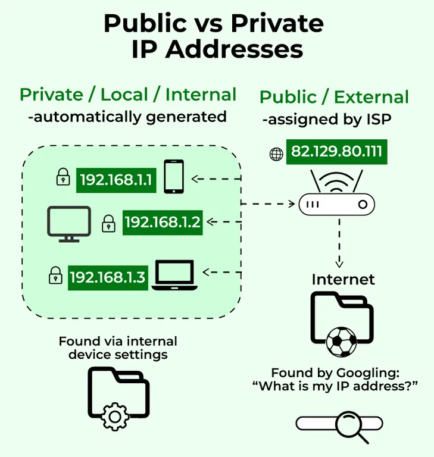

Public and private IP addresses are the two “scopes” at which an IP can exist: one on the global internet, one inside local networks like your home LAN.

I’ll keep this tight but precise.

***

## Core Idea

- **Public IP address**: Globally unique and routable on the internet.  
- **Private IP address**: Used only inside local/private networks; not routable on the public internet.

They’re both IPv4 addresses, but they live in different “address spaces” logically.

***

## Public IP Address

- Assigned by your ISP or by an upstream provider.
- Unique on the public internet — no two unrelated entities should share the same public IP at the same time.
- Used by:
  - Web servers and APIs you reach over the internet.
  - Your home router’s “WAN” interface (often a dynamic public IP).
  - VPN gateways, mail servers, etc.

If you visit “what’s my IP” in your browser, you’re seeing **your current public IP** (the one your ISP gave your router).

Key property:

- Public IPs are **globally routable**: routers on the internet will forward packets addressed to them.

***

## Private IP Address

RFC 1918 defines special IPv4 ranges reserved for internal use:

- `10.0.0.0 – 10.255.255.255` (`10.0.0.0/8`)
- `172.16.0.0 – 172.31.255.255` (`172.16.0.0/12`)
- `192.168.0.0 – 192.168.255.255` (`192.168.0.0/16`)

Properties:

- Not globally unique; many different networks can reuse the same private ranges.
- **Not routable** on the public internet: backbone routers drop these ranges.
- Used inside:
  - Home LANs (e.g., `192.168.1.0/24`).
  - Office networks.
  - Cloud VPCs.

Your phone, laptop, TV at home likely have addresses like `192.168.x.y` or `10.x.y.z` — these are **private IPs**.

***

## How Public and Private Work Together (NAT)

Home/office networks typically have:

- Many devices with **private IPs** on the LAN.
- One router with a **public IP** on the WAN.

Network Address Translation (NAT) on the router:

- Translates many private IPs behind it into one public IP when going out to the internet.
- Keeps a mapping of “internal IP:port ↔ external IP:port” so replies return to the right device.



Conceptually:

```text
Phone: 192.168.0.10
Laptop: 192.168.0.11
NAS:    192.168.0.12
            |
         Router (LAN side: 192.168.0.1, WAN side: 203.0.113.42)
            |
          Internet (public)
```

To the outside world, all traffic appears to come from `203.0.113.42` (the public IP); the router sorts out which internal private IP should receive which response.

***

## Why the Split Exists

- IPv4 public address space is small (~4.3 billion addresses), so we can’t give every device a globally unique public IP.
- Private ranges + NAT let billions of devices exist behind a relatively small pool of public IPs.
- Security: private IPs aren’t directly reachable from the internet; you must open ports, use port forwarding, VPNs, or similar to expose services intentionally.

***

## Quick Mental Summary

- Public IP = your “house address” on the global internet.
- Private IP = room numbers inside the house.
- NAT = the receptionist that knows which room each outgoing/incoming message belongs to.
