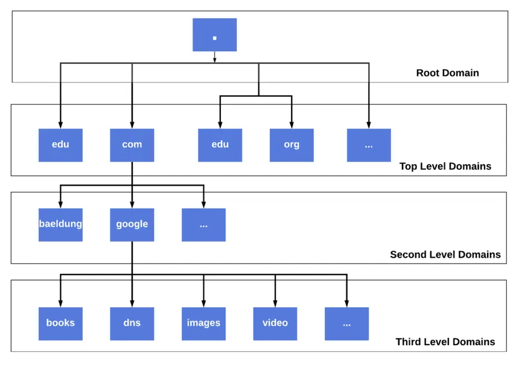
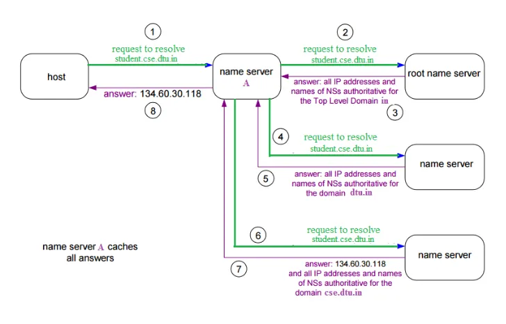

## Understanding DNS

DNS is the internet’s naming system: it maps human-friendly names like `www.google.com` to IP addresses so your device can find the right server. Without DNS, you’d have to remember numeric IP addresses for every site you visit. [coursera](https://www.coursera.org/in/articles/domain-name-system)

## Why DNS Exists

Computers route packets using IP addresses, but humans think in names, so DNS acts like a distributed lookup system between the two. It was designed as a hierarchical and delegated system so one central file wouldn’t have to store the entire internet’s naming data. [cisco](https://www.cisco.com/c/en/us/support/docs/ip/domain-name-system-dns/12683-dns-descript.html)

## Names and hierarchy

DNS names are hierarchical, read from right to left: in `www.google.com`, `.com` is the top-level domain, `google.com` is a domain under `.com`, and `www.google.com` is a subdomain of `google.com`. The confusing part is that tutorials often say “`www` is the subdomain,” but that is shorthand; strictly speaking, **the full name** `www.google.com` is the subdomain, while `www` is only the leftmost label that creates it. [docs.oracle](https://docs.oracle.com/cd/E19683-01/817-4843/dnsintro-64/index.html)

Because DNS is relative, `google.com` is also itself a subdomain of `com` in the larger tree. [en.wikipedia](https://en.wikipedia.org/wiki/Subdomain)

## Main DNS players

Several pieces work together during a lookup: [fortinet](https://www.fortinet.com/resources/cyberglossary/what-is-dns)

- **Stub resolver**: the small DNS client in your OS.
- **Recursive resolver**: the DNS server your device asks first, often your router, ISP, or a public resolver.
- **Root servers**: know where TLD servers are.
- **TLD servers**: know which authoritative servers handle a domain like `google.com`.
- **Authoritative servers**: hold the actual DNS records for a domain.

The recursive resolver is the main “worker” here; your device usually asks just that one server, and it does the rest. [fortinet](https://www.fortinet.com/resources/cyberglossary/what-is-dns)

## How a lookup works

When you type `www.google.com`, your device first checks local caches and the hosts file; if it already knows the answer, it stops there. If not, it asks a recursive resolver, which may also answer from cache if it has a fresh entry. [cisco](https://www.cisco.com/c/en/us/support/docs/ip/domain-name-system-dns/12683-dns-descript.html)

If the resolver has no cached answer, it walks the DNS hierarchy: [fortinet](https://www.fortinet.com/resources/cyberglossary/what-is-dns)

1. Ask a root server: “Who handles `.com`?” [fortinet](https://www.fortinet.com/resources/cyberglossary/what-is-dns)
2. Ask a `.com` TLD server: “Who is authoritative for `google.com`?” [fortinet](https://www.fortinet.com/resources/cyberglossary/what-is-dns)
3. Ask the authoritative server: “What is the A or AAAA record for `www.google.com`?” [cisco](https://www.cisco.com/c/en/us/support/docs/ip/domain-name-system-dns/12683-dns-descript.html)
4. Return the answer to your device and cache it for later [fortinet](https://www.fortinet.com/resources/cyberglossary/what-is-dns)

Only after DNS returns an IP address can the browser open a connection and start HTTP or HTTPS. [coursera](https://www.coursera.org/in/articles/domain-name-system)

## Common DNS records

DNS is really a distributed database of record types: [geeksforgeeks](https://www.geeksforgeeks.org/computer-networks/domain-name-system-dns-in-application-layer/)

- **A**: maps a name to an IPv4 address [geeksforgeeks](https://www.geeksforgeeks.org/computer-networks/domain-name-system-dns-in-application-layer/)
- **AAAA**: maps a name to an IPv6 address [geeksforgeeks](https://www.geeksforgeeks.org/computer-networks/domain-name-system-dns-in-application-layer/)
- **CNAME**: makes one name an alias of another name [geeksforgeeks](https://www.geeksforgeeks.org/computer-networks/domain-name-system-dns-in-application-layer/)
- **MX**: tells mail systems where to deliver email for a domain [geeksforgeeks](https://www.geeksforgeeks.org/computer-networks/domain-name-system-dns-in-application-layer/)
- **NS**: says which name servers are authoritative for a domain or zone [geeksforgeeks](https://www.geeksforgeeks.org/computer-networks/domain-name-system-dns-in-application-layer/)
- **TXT**: stores text data, often for SPF, DKIM, and domain verification [geeksforgeeks](https://www.geeksforgeeks.org/computer-networks/domain-name-system-dns-in-application-layer/)

A useful mental model: `A/AAAA` answer “where is it?”, `CNAME` says “ask using this other name,” and `MX` answers “where should email go?”. [geeksforgeeks](https://www.geeksforgeeks.org/computer-networks/domain-name-system-dns-in-application-layer/)

## Zones and delegation

A **zone** is the part of the DNS namespace managed by a particular authority, such as `example.com` and its records. DNS scales because control is delegated: `.com` doesn’t manage all of `google.com`’s records; it only points to the authoritative servers that do. [en.wikipedia](https://en.wikipedia.org/wiki/Domain_Name_System)

That is one of the most important ideas in networking: DNS is not one giant database, but a tree of delegated responsibility. [en.wikipedia](https://en.wikipedia.org/wiki/Domain_Name_System)

## Caching and TTL

DNS would be too slow if every lookup had to go root → TLD → authoritative every time, so caching is essential. Each record has a **TTL** (time to live), which tells resolvers how long they may reuse a cached answer before asking again. [fortinet](https://www.fortinet.com/resources/cyberglossary/what-is-dns)

High TTL means better performance and less load, but slower propagation when records change. Low TTL means faster updates, but more queries and more dependence on live DNS infrastructure. [fortinet](https://www.fortinet.com/resources/cyberglossary/what-is-dns)

## Why DNS matters for engineers

DNS affects real systems more than people expect: [coursera](https://www.coursera.org/in/articles/domain-name-system)

- A bad DNS record can break an app even when the servers are healthy [cisco](https://www.cisco.com/c/en/us/support/docs/ip/domain-name-system-dns/12683-dns-descript.html)
- A high TTL can delay traffic migration during deployment [fortinet](https://www.fortinet.com/resources/cyberglossary/what-is-dns)
- Internal systems often use private DNS names that resolve to private IPs [cisco](https://www.cisco.com/c/en/us/support/docs/ip/domain-name-system-dns/12683-dns-descript.html)
- Load balancing, failover, CDNs, and service discovery often lean on DNS behavior [cisco](https://www.cisco.com/c/en/us/support/docs/ip/domain-name-system-dns/12683-dns-descript.html)

That’s why “it’s always DNS” became a meme: a lot of distributed-system failures look like app bugs at first, but turn out to be naming, caching, or resolution problems. [cisco](https://www.cisco.com/c/en/us/support/docs/ip/domain-name-system-dns/12683-dns-descript.html)

## Minimal mental model

DNS is a hierarchical, distributed naming system that turns names into records, usually IP addresses. Your device asks a recursive resolver, the resolver checks cache or walks the chain root → TLD → authoritative, then returns the answer and caches it. [coursera](https://www.coursera.org/in/articles/domain-name-system)

And the naming correction to remember is this:

- `google.com` is a domain under `.com` [docs.oracle](https://docs.oracle.com/cd/E19683-01/817-4843/dnsintro-64/index.html)
- `www.google.com` is a subdomain of `google.com` [knowledge.workspace.google](https://knowledge.workspace.google.com/admin/domains/domain-name-basics)
- `www` alone is just a label, not the full subdomain name [superuser](https://superuser.com/questions/1644463/difference-between-subdomain-hostname-host-and-www-in-a-dns-system)
