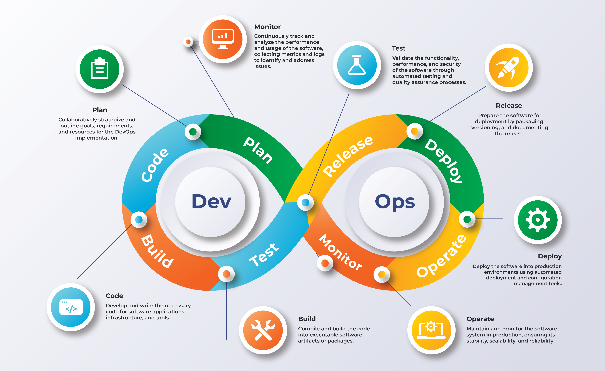

# 🚀 What is DevOps?  

DevOps is a **culture**, a set of **practices**, and a collection of **tools** that bring together  
**Development (Dev)** and **Operations (Ops)** teams so software can be planned, built, tested,  
released, deployed, operated, and monitored **continuously** with higher speed and reliability.

DevOps eliminates the old “Dev vs Ops” gap and makes both teams work as **one unit** with shared responsibility for the entire product lifecycle.

---

# 💡 Why DevOps Exists

Before DevOps:
- Dev team built features.
- Ops team handled servers and deployments.
- Teams worked separately → slow releases, conflicts, instability.

DevOps solves this by:
- Improving collaboration  
- Increasing automation  
- Reducing errors  
- Releasing faster  
- Increasing reliability  

---

# 🧩 Core Components of DevOps

## 1️⃣ Culture & Collaboration
- Dev + Ops + QA + Product work together.
- Shared ownership of code, servers, and outcomes.
- No blame — only improvement.

## 2️⃣ Automation (Where CI/CD Lives)
- Automate builds  
- Automate tests  
- Automate deployments  
- Automate infrastructure provisioning  
- Automate rollbacks  

Automation is the **heart** of DevOps.

## 3️⃣ Measurement
- Monitor performance  
- Track deployment frequency, MTTR, failures  
- Use data to improve processes  

## 4️⃣ Continuous Improvement
- Always analyze & refine processes.
- Smaller changes → faster recovery → fewer bugs.

---

# 🔄 DevOps Lifecycle (Infinity Loop)

DevOps follows a continuous cycle:

**PLAN → CODE → BUILD → TEST → RELEASE → DEPLOY → OPERATE → MONITOR → repeat**

Below is each step in detail and where **CI** and **CD** fit into it.

---

# 📝 1. PLAN
Teams define:
- Features  
- Requirements  
- Tasks  
- Architecture  

**Tools:** Jira, Trello, GitHub Projects  
**CI/CD involvement:** ❌ None  

---

# 💻 2. CODE
Developers write:
- Application code  
- Unit tests  
- Documentation  

**Tools:** VS Code, Git, GitHub/GitLab  
**CI/CD involvement:**  
- **CI triggers automatically** when code is pushed or PR is created.

---

# 🏗️ 3. BUILD
The source code is converted into a usable artifact:
- Compiling  
- Packaging  
- Building Docker images  

**CI involvement:**  
✔️ **Continuous Integration automates the Build step**

---

# 🧪 4. TEST
Automated testing:
- Unit tests  
- Integration tests  
- API tests  
- UI tests  

**CI involvement:**  
✔️ **CI automatically runs all tests**  
❌ If tests fail → pipeline stops  

**Continuous Integration includes:**  
**CODE → BUILD → TEST**

---

# 📦 5. RELEASE
A successful build is prepared for deployment:
- Versioning  
- Release notes  
- Pushing artifacts to registry  

**CD involvement (Continuous Delivery / Deployment):**  
✔️ CD packages release artifacts  
✔️ CD publishes to staging  

---

# 🚀 6. DEPLOY
Deploy application to:
- Staging  
- QA  
- Production  

**CD involvement:**  
- **Continuous Delivery** → auto-deploy to staging, manual approval for prod  
- **Continuous Deployment** → auto-deploy to production with NO approval  

**Continuous Delivery / Deployment includes:**  
**RELEASE → DEPLOY**

---

# ⚙️ 7. OPERATE
Ensure system stability:
- Scaling  
- Server management  
- Config updates  
- Incident response  

**CD involvement:**  
- Automated rollbacks  
- Post-deploy health checks  
- Auto-scaling scripts  

---

# 📊 8. MONITOR
Observe everything:
- Logs  
- Metrics  
- Errors  
- User experience  

**Tools:** Prometheus, Grafana, ELK, Datadog, CloudWatch  
**CI/CD involvement:**  
- Pipelines may use monitoring data for rollback triggers  
- But the monitoring itself is part of DevOps, not CI/CD

---

# 🧠 Summary: Where Do CI & CD Fit?

## ✔️ Continuous Integration (CI)
Automates:
- CODE  
- BUILD  
- TEST  

## ✔️ Continuous Delivery / Deployment (CD)
Automates:
- RELEASE  
- DEPLOY  
(And partially OPERATE — health checks & rollbacks)

---

# ⭐ One-Sentence Definition Combining Everything

> **DevOps is a culture and practice where development and operations work together across the entire software lifecycle, while CI (Continuous Integration) automates building & testing code, and CD (Continuous Delivery/Deployment) automates releasing & deploying that code, enabling fast, safe, and continuous delivery of software.**

---

# 🎯 Final Visual Summary

**DevOps Lifecycle:**  
PLAN → CODE → BUILD → TEST → RELEASE → DEPLOY → OPERATE → MONITOR  

**CI = CODE + BUILD + TEST**  
**CD = RELEASE + DEPLOY (+ automatic checks & rollbacks)**  

https://www.serole.com/blog/what-are-the-key-benefits-of-devops-for-businesses/